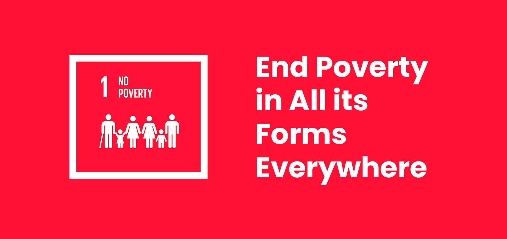
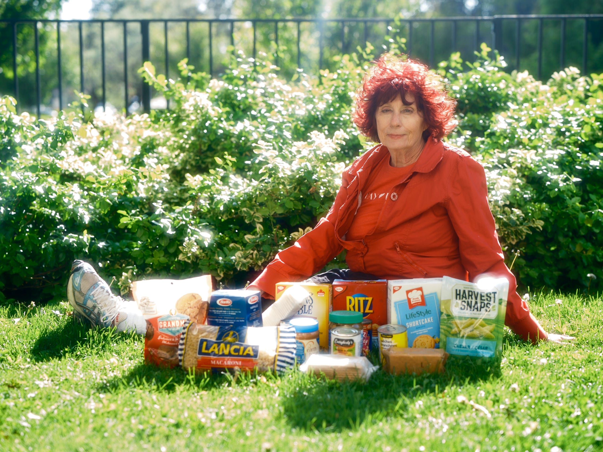

# SDG #1: No Poverty

```{r, echo=FALSE, out.width="50%", fig.align="center", fig.cap="No Poverty"}

```

The United Nations Sustainable Development Goal 1, often called “No Poverty,” aims to end poverty in all its forms everywhere by 2030. This includes eliminating extreme poverty—defined as living on very little income per day—and reducing broader forms of poverty that affect access to basic needs like housing, healthcare, and education. Despite progress in past decades, poverty remains a major global issue, with around 1 in 10 people worldwide still living in extreme poverty and progress recently slowing or even stalling due to global crises. The goal also emphasizes expanding social protection systems and ensuring equal access to economic resources to help vulnerable populations escape poverty long-term.

A challenge to achieving this goal is the strong connection between poverty and food insecurity. According to the World Bank, global food systems are under increasing pressure from conflict, climate change, and rising costs, all of which make it harder for people to afford enough food. Recent data shows that tens of millions more people could face acute hunger due to disruptions in global supply chains and rising fertilizer and food prices. In many regions, food price inflation is outpacing overall inflation, meaning that even when incomes rise slightly, people can still struggle to afford basic nutrition. This demonstrates how poverty is not just about income, but also about access to essential resources like food.

```{r, echo=FALSE, out.width="50%", fig.align="center", fig.cap="lady stuggling to afford groceries"}

```

Rising living costs, particularly for groceries, further highlight how poverty affects both developing and wealthier countries. I found an article discussing the conversation between a reporter and older Canadian lady. She goes into detail about the rise in cost when it comes to housing and groceries. This goes to show that even in higher-income countries, more people are experiencing food insecurity as wages fail to keep up with rising prices. This reflects a broader reality: poverty is a global issue shaped by economic systems, inequality, and external shocks. Achieving the “No Poverty” goal will therefore require not only reducing income poverty but also addressing systemic issues like inflation, food access, and economic inequality worldwide.

In conclusion, achieving Sustainable Development Goal 1, No Poverty, requires addressing the complex and interconnected challenges that keep people in poverty around the world. As highlighted by the United Nations, ending poverty is not just about increasing income, but also about ensuring access to basic needs, social protection, and economic opportunity. The growing issues of food insecurity and rising living costs, discussed by the World Bank and reported between the older woman and reporter, show how global crises and inflation continue to push vulnerable populations further into hardship. To make meaningful progress by 2030, countries must work together to create more stable, equitable systems that reduce inequality and improve access to essential resources for all.


