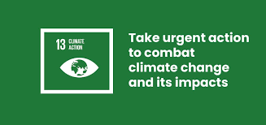
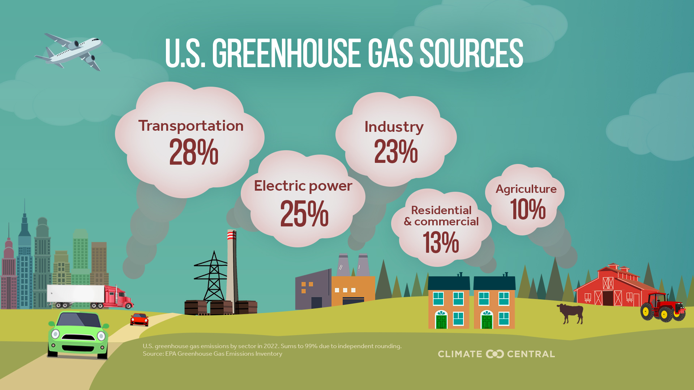

# SDG #13: Climate action

```{r, echo=FALSE, out.width="50%", fig.align="center", fig.cap="Climate Action"}

```

Sustainable Development Goal 13, known as Climate Action, focuses on taking urgent steps to combat climate change and its impacts on the planet. According to the United Nations Global Goals initiative, climate change is already affecting ecosystems, economies, and human life, and will become increasingly catastrophic without immediate action. This goal emphasizes strengthening resilience to climate-related disasters, integrating climate policies into national planning, and improving education and awareness about climate change. It also highlights that addressing climate change is not just about preventing damage, but also about creating opportunities for innovation, economic growth, and a more sustainable future.

Climate action involves both large-scale policy efforts and everyday actions by individuals and communities. The United States Environmental Protection Agency explains that reducing greenhouse gas emissions, improving energy efficiency, and investing in clean technologies are key strategies for addressing climate change. Governments and organizations measure emissions, develop policies, and invest in infrastructure to reduce environmental impact while protecting public health. At the same time, individuals can contribute by using renewable energy, reducing waste, and choosing more sustainable transportation options. These combined efforts, from global agreements to personal behavior, are essential for slowing climate change and building resilience.

```{r, echo=FALSE, out.width="50%", fig.align="center", fig.cap="Greenhouse gas"}

```

The human impact of climate change makes this goal especially urgent. Stories highlighted by groups like The Wilderness Society show how people around the world are already experiencing stronger storms, wildfires, droughts, and rising sea levels. These impacts often fall hardest on vulnerable communities, inspiring individuals and activists to take action and advocate for change. Personal experiences with climate-related disasters can motivate communities to push for stronger environmental protections and more sustainable practices, showing that climate action is both a global and deeply personal issue.

In conclusion, Climate Action as a sustainable development goal is critical to ensuring the long-term health of the planet and its people. It requires coordinated efforts from governments, organizations, and individuals to reduce emissions, adapt to environmental changes, and promote sustainability. As climate change continues to affect communities worldwide, taking action now is essential to prevent more severe consequences in the future. Ultimately, achieving this goal means creating a safer, more resilient world where both people and ecosystems can thrive.
