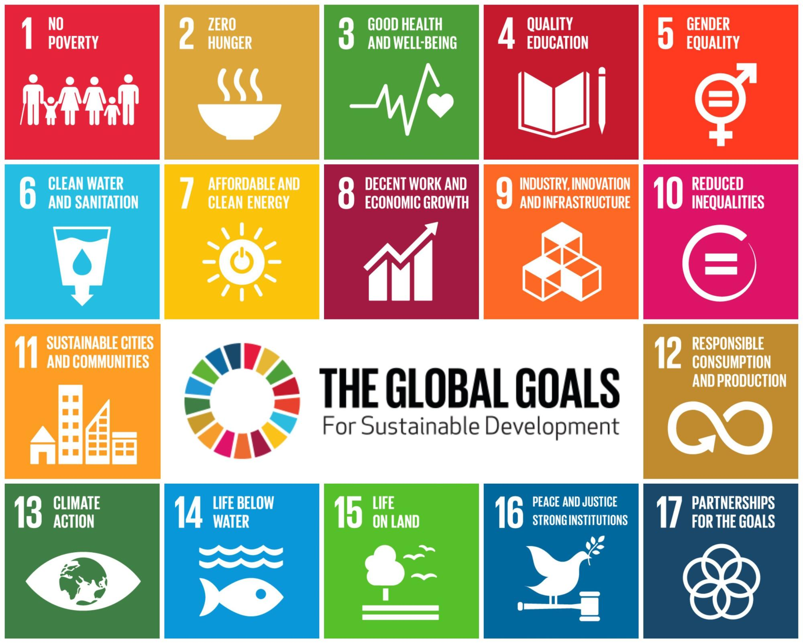

--- 
title: "Work Cited"
author: "Sophie Nolen"
date: "`r Sys.Date()`"
site: bookdown::bookdown_site
output: 
  bookdown::gitbook:
    config:
      sharing:
        facebook: false
        twitter: false
documentclass: book
bibliography: [bibliography.bib]
biblio-style: apalike
link-citations: yes
github-repo: https://github.com/ericmkeen/bookdown_minimal
description: "DESCRIPTION yall."
---

# Introduction

```{r, echo=FALSE, out.width="50%", fig.align="center", fig.cap="Sustainable Development Goals"}

```

  The Sustainable Development Goals (SDGs) are a set of 17 global objectives established by the United Nations in 2015 as part of the broader 2030 Agenda for Sustainable Development. They were created to address the world’s most pressing challenges, including poverty, inequality, climate change, environmental degradation, peace, and justice. Each goal is interconnected, recognizing that progress in one area, such as education or clean energy, often depends on progress in others. The SDGs apply to all countries, not just developing nations, and emphasize a collaborative approach involving governments, businesses, and individuals.

  The purpose of the SDGs is to create a more sustainable, equitable, and prosperous world by the year 2030. They aim to balance three core dimensions of sustainability: economic growth, social inclusion, and environmental protection. By setting measurable targets, such as reducing extreme poverty, improving access to clean water, and combating climate change, the SDGs provide a shared framework for action and accountability. Ultimately, their goal is to ensure that development meets present needs without compromising the ability of future generations to meet their own, promoting long-term global well-being.

  Data for SDGs is collected through a coordinated global system led by the United Nations, particularly its statistical branch, the UN Statistical Commission. Countries gather most of the data themselves through national statistical offices using sources like censuses, household surveys, administrative records (such as school enrollment or health data), and environmental monitoring systems. This national data is then standardized and compiled by international organizations to ensure consistency and comparability across countries. In addition, newer methods, such as satellite imagery, big data, and partnerships with private companies, are increasingly used to fill gaps, especially in regions where traditional data collection is limited. All of this information is tracked through a set of global indicators, allowing progress toward each goal to be measured and reported over time.

